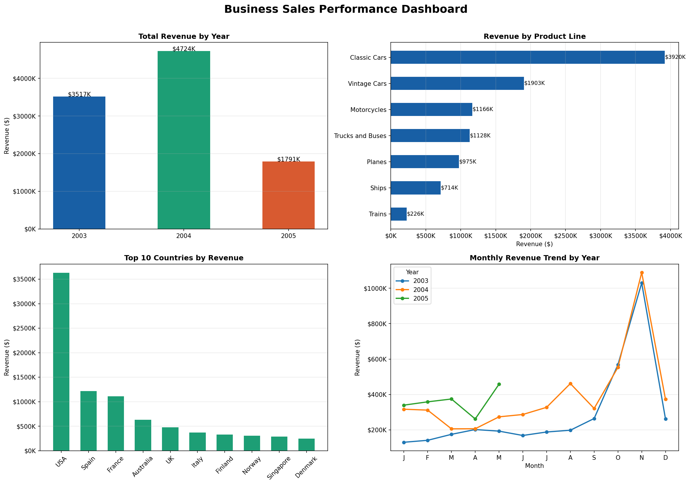

# Task 1 - Business Sales Performance Analytics
## Future Interns | Data Science & Analytics Track

## Overview
Analyzed real-world business sales data from Kaggle to identify 
revenue trends, top-selling product lines, and regional performance.

## Tools Used
- Python (Pandas, Matplotlib, NumPy)
- Google Colab
- GitHub for version control

## Dataset
- Source: Sample Sales Data (Kaggle)
- Real dataset with encoding issues, date formatting and missing values

## Key Insights
- Revenue heavily concentrated in top product lines (80/20 pattern)
- Clear Q4 revenue spikes across all years
- Top country dominates overall sales significantly
- Classic Wines & Motorcycles lead product line revenue

## Recommendations
1. Double down on top performing product lines
2. Expand operations in top revenue countries
3. Replicate Q4 peak strategies year-round
4. Investigate underperforming countries for growth decisions

## Challenges Faced
- Dataset had encoding issues — solved using latin1 encoding
- Date formatting required conversion before analysis
- Accidentally pasted markdown text into a code cell causing 
  a SyntaxError — identified the issue independently and fixed 
  it by converting the cell type from Code to Text in Google Colab

## What I Learned
- How to clean a real-world messy dataset
- How to extract meaningful KPIs from raw sales data
- How to build multi-panel dashboards using Matplotlib
- How to troubleshoot and fix errors independently

## Files
- Task1_Sales_Analysis_V2.ipynb — Full improved analysis notebook
- sales_dashboard_v2.png — Professional 4-chart dashboard
- sales_data_sample.csv — Real dataset from Kaggle

